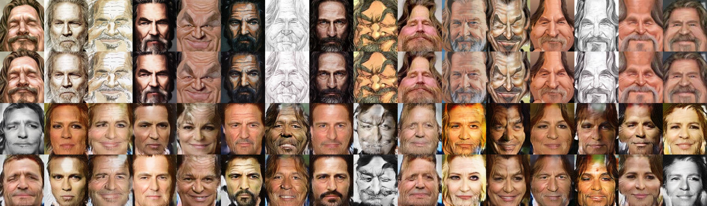

这个git仓库是我个人毕业设计的git仓库，里面是**未经整理**的各种代码。在这段README中，首先我会介绍我毕业设计包含的内容，然后对这个仓库中的各个文件夹进行说明。

**然后可以多说几句的点是，自己在这个仓库里实现了pytorch版本的SAGAN（[代码地址](codes/SATNet/networks.py#L311)|[论文地址](https://arxiv.org/abs/1805.08318)），虽然实际运行起来和目前网上的其他实现版本没多大差异，但是自己对SAGAN的效果还是挺满意的，以及是自己实现的，所以mark一下。**

**还有自己也尝试了实现Deformable ConvNets v2（[论文地址](https://arxiv.org/abs/1811.11168)），不过实现的代码有不能载入预训练权重的bug，自己觉得问题可能在自己对Deformable模块的学习率处理上，不过因为自己目前还没有好的解决方法，毕设也结束了，所以自己删除了相关代码所在的branch。**

# 毕设内容介绍
## 总体目标介绍
本研究希望可以实现人脸的照片和画像的互相转化。自己理想的转化方法和一般不改变图像内容，只改变纹理的风格化方法有所不同。根据人脸照片生成的画像被“艺术化”，保留人脸上可以识别身份的特征，但是有着各种夸张的细节。同时从人脸画像生成的人脸照片也能保留画像中展示的身份特征，并有着和真实世界相同的人脸结构。

目前的结果和目标还是有着挺大的差距的。主要缺点有二：首先，照片生成画像方面，模型发生了mode dropping，目前生成的画像还是和风格化的结果非常类似，我觉得导致这个情况发生的原因是数据集中的画像风格太过分散，如果考虑只做某一风格画像的转化，并收集足够多的数据，应该可以缓解这个问题。其次，画像生成照片方面，目前自己对生成照片观感上的相似性还算满意，但是身份上的相似性并不是特别好。在预训练并微调后的SphereFace网络监督下，目前的网络的确可以在一定程度上保留画像的身份，但是有些男性的画像生成的照片会被涂上口红或者被磨皮，显得和女性十分相似，在这个方面，我觉得可以考虑加强SphereFace的监督力度，这一部分实验自己因为时间原因没有去做。

放一下目前的结果


## 人脸识别部分
为了更好地保留图像翻译结果中的身份特征，本项目采用了人脸识别网络对训练的网络进行指导。

本项目采用了来自[sphereface_pytorch](https://github.com/clcarwin/sphereface_pytorch)的预训练权重，并针对[WebCaricature数据集](https://cs.nju.edu.cn/rl/WebCaricature.htm)进行了微调。得到了相对于[WebCaricature论文](https://arxiv.org/abs/1703.03230)中更优的结果，见下表：

| 方法 | FAR=0.1%(%) | FAR=1%(%) | AUC |
|------|-------------|-----------|-----|
| SIFT-Land | 4.43±0.82 | 15.24±2.03 | 0.780±0.017 |
| VGG-BOX | 32.07±2.60 | 56.76±2.35 | 0.946±0.005 |
| VGG-Eye | 19.24±1.95 | 40.88±2.23 | 0.898±0.007 |
| **SphereFace-fine-tuned** | **94.58±3.99** | **96.82±2.50** | **0.996±0.004** |

[微调后的SphereFace权重](https://drive.google.com/open?id=1esOigCk0lCPM8ZE3dSS3zJ_5oJ4wTq0Y)

目前的人脸识别的loss就是简单的hinge形式，即 L = max(0, threshold - dist)。自己认为接下来可以试一试参照Knowledge Distillation，即生成图像要和原图像在高维空间中的某个特征一致，同时用一个类似T的参数控制学习的强度。

## 数据集预处理
为了配合人脸识别网络对训练的监督，自己对[WebCaricature数据集](https://cs.nju.edu.cn/rl/WebCaricature.htm)进行了转正，并剔除了转正后的侧脸图片以及五官位置与参照关键点偏差过大的图片，见[代码](codes/SATNet/data.py#L257)。

目前的结果表明剔除不规范数据后，模型的训练结果会表现得好一些。

## 图像翻译部分
说一下模型主体。

本项目主要的研究内容是关于人脸照片和画像的相互转换的，可以看做是一个特殊的图像翻译问题（如果把网络训练中关于人脸的设置去掉，项目中的网络模型可以用于通用的图像翻译问题）。

项目在网络结构和训练策略上采用了堆叠各种新技术的方法来提高训练结果的评价指标，主要添加的新技术有SAGAN（[代码地址](codes/SATNet/networks.py#L311)|[论文地址](https://arxiv.org/abs/1805.08318)）、Spectral Normalization（[论文地址](https://arxiv.org/abs/1802.05957)）、TTUR（[论文地址](https://arxiv.org/abs/1706.08500)）和hinge形式的adversarial loss（[论文地址](https://arxiv.org/abs/1702.08896)）。~~反正新技术看见了梭哈梭哈就完事了（开玩笑。~~

为了节省时间，主要的训练代码copy自[MUNIT源码](https://github.com/NVlabs/MUNIT)，然后自己对其修改和添加，之后用于训练。

本项目的基础假设也来自MUNIT（[代码地址](https://github.com/NVlabs/MUNIT)|[论文地址](https://arxiv.org/abs/1804.04732)），可以认为本项目是MUNIT在人脸照片-画像互相转化这个任务上的特别强化。

# 文件夹结构
**自己写的代码很乱，没有整理，如果有人想根据我的代码做一些改进的实验的话，建议自己重新组织一下代码，否则之后的代码管理会非常糟糕。**
```
--codes                 // 代码文件夹
 |--3rdparty            // 第3方软件库
 |--dltools             // 帮助训练的代码
 |--mysite              // django文件夹
   |--datasetviewer     // 用来展示数据集的django app
   |--mysite            // django project的设置代码
   |--stylized_face     // 在线风格化图片的django app
 |--recoder             // 本来想用来存一些日常操作的代码，以减少劳动量，没啥用
 |--SATNet              // self-attention-transfer-net，名字随便取得
 |--sphereface          // sphereface fine tunning代码
--reports               // 自己日常写的一些报告，内容有点杂乱和啰嗦
```

# 运行命令
请注意一些命令是带参数的，参数的作用见对应代码
```
// 训练SATNet
python codes/dltools/fid_trainer.py
// 启动django project
python codes/mysite/manage.py runserver
// 对数据集进行人脸转正
python codes/mysite/warp.py
// sphereface fine tunning
python codes/sphereface/transfer_learning.py
```
## 依赖环境
如果你发现有些依赖不在下方列表中，请原理我的疏忽。
- python 3.6.5
- pytorch
- numpy
- cv2
- django
- dlib

# 几个实验现象
- 剔除数据集中的侧脸图片可以带来更好的实验结果
- 自注意力模块可以帮助下降FID，但是在小分辨率情况下（96*112），有自注意力模块的模型生成的结果往往会有棋盘效应
- LSGAN对模型的限制很大，生成结果也有点单一，hinge形式的GAN就不会有这种问题

# 改进方向
谈一谈我自己认为值得尝试、但自己又没有来得及做的几点。
- 想试一试能不能用deformable convnet来帮助生成更好的结果
- 尝试一下知识蒸馏，目前SphereFace在训练中的作用仅仅只是做一个hinge的身份损失，感觉关于如何利用人脸识别网络，还有很大的尝试空间

## 监督学习方向
还可以考虑往监督学习方向来设计训练，[WebCaricature数据集](https://cs.nju.edu.cn/rl/WebCaricature.htm)中的每张图片都有身份信息，如果考虑强制让同一身份的生成照片（或画像）和真实照片（或画像）之间有一个损失，是否可以更好地引导网络学习相关知识？

## 无监督学习方向
往无监督的学习方向来设计训练可以减少对特定数据集的依赖。自己其实也想过能不能用一个大型的有身份标记的照片数据集和另一个大型的有身份标记的画像数据集来进行训练，同时指定画像的具体风格（比如漫画或者油画一类的），应该能训练出有不错观感结果的模型。不过要考虑画像的landmark提取工作还是有一些问题的，输入格式不能固定会导致模型中的可以感知全局的模块学不到东西，全局模块学习失败也就意味着模型无法感知到输入的全局属性（也就是人脸的整体特征）。
