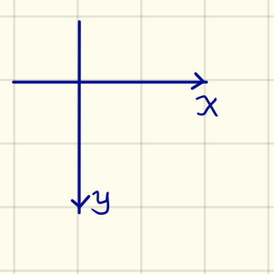

<h1>毕设数据集处理报告</h1>

<i>written by  <a href="http://yujiachen.top/">Yu, Jiachen</a></i>

# README信息
## 统计
有252个对象，以及来自这252个对象的6042张漫画和5974张图片。
每张图片有不同的分辨率，以及有的图像是灰度图像，有的图象是RGB图像。
每张图像上都有17个脸部landmarks
数据集网站：https://cs.nju.edu.cn/rl/WebCaricature.htm

## 文件结构
- OriginalImages：目录下是各个人名的子目录，每个人名子目录下C开头的照片是卡通画像，P开头的是真实照片
- FacialPoints：以txt的形式存着每张照片的landmark，每个landmark点两个数字，前面代表着x轴坐标，后面代表着y轴坐标，不过注意一张图片被读进的坐标如下，landmark的格式如下
  
  

| Landmark | Meaning | Landmark | Meaning |
| ------ | ------ | ------ | ------|
| 1 | Contour(Top of Hairline) | 10 | Right corner of left eye |
| 2 | Contour(Center of left ear) | 11 | Left corner of right eye |
| 3 | Contour(Chin) | 12 | Right corner of right eye |
| 4 | Contour(Center of right ear) | 13 | Nose tip |
| 5 | Left corner of left eyebrow | 14 | Mouth upper lip top |
| 6 | Right corner of left eyebrow | 15 | Mouth left corner |
| 7 | Left corner of right eyebrow | 16 | Mouth lower lip bottom |
| 8 | Right corner of right eyebrow | 17 | Mouth right corner |
| 9 | Left corner of left eye |  |  |
- Filenames: 以txt的形式存着每个人对应的漫画图片和真实照片的文件名。
- EvaluationProtocols：存放着各个评价方案在各种情况下所需用到的各种数据。

## 命名
略过不谈。

## 评价方案
对所有4个评价方案的实验设置，有2种设置(two views)。设置1(View 1)中的数据只应该用来调整参数，设置2(View 2)中的数据用来评估模型的性能。

**数据集中的说明在此不翻译，如有需要请自行查看数据集中的Readme.txt文件**

### 严格漫画验证
略，请自行查阅Readme.txt

### 非严格漫画验证
略，请自行查阅Readme.txt

### 漫画-照片识别
略，请自行查阅Readme.txt

### 照片-漫画识别
略，请自行查阅Readme.txt

## 注意：
1. 该数据集只能用于学术目的
2. 请不要重新布置或修改数据集
3. 如您有漏洞报告，或关于使用数据集的疑问或建议，请联系Jing Huo (huojing@nju.edu.cn)

# WebCaricature: a benchmark for caricature recognition
接下来写一下对数据集论文的小结，参考的论文是[1]的v4版本

### 介绍
论文提到了现有的几个数据集：

### 数据采集
- 数据的收集是通过google image搜索得来的
- 照片的landmark是用face++的api标的
- **画像的landmark是手工标的，但文章没说标记的具体流程和消耗的资源**

### 评价方案
- 文章说明了使用数据集时，哪些数据可以用在哪些步骤中
- 文章建议Caricature Verification任务的评测指标是ROC的AUC、FAR=0.1%时的验证正确率和FAR=1%时的验证正确率
- 文章建议Caricature Identification任务的评测指标是CMC中的rank-1和rank-10
- 文章建议的评测方法是用10-fold的交叉验证，对10次得到的最终结果取平均得到最终评测结果
- **文章没有给出制定上述评价方案的依据**，自己认为如果给出相关的依据，会利于人们对数据集设置的理解

### 识别框架
#### landmark标记
画像是用手工标记的，落实到框架里如何标记目前没有解决方案，**自己感觉如何正确标记出画像的landmark可以单独作为一个课题拿出来做**

#### 脸部对齐
文章采用了三个方案，具体的操作和参数见论文
1 根据两个眼睛的关键点位置来完成alignment（根据[3]里面的实验结果，自己打算用5个或者3个landmark做相似变换来align）
2 根据17个landmark的位置得到17个patch，从17个patch中抽取特征
3 根据脸外围的4个轮廓点，把脸裁出来

#### 匹配算法
- [ ] 作者多次提到了自己的跨模态尺度学习方法[2]，有空看一看。

## Balseline表现
具体数据见原文。

文中说到了第2中脸部对齐方法在传统模型里的表现最好，但是不适合应用在深度学习里，所以就没做相关实验，以及文中后面明确说了实验没有fine tune vgg face，而是直接用的vgg face的原参数。

# 数据集处理
因为图像生成任务本身有一定难度，所以预处理数据集，来简化模型的任务也是一个需要仔细考虑的问题，目前打算有如下对数据集进行处理的打算。
- 人脸转正：根据landmark从原图中抠出人脸块，转正，然后考虑如何处理筛选出的数据
- 数据筛选：踢掉一些难度过高的数据，然后考虑如何处理筛选出的数据
- 不对数据集进行处理

## 人脸转正

**为什么要进行人脸转正？**

关于人脸转正是否能帮助人脸识别网络识别人脸是有争议的[需要引用]，但是不能否认的是现在绝大多数人脸识别网络都对输入图像做了人脸转正[需要引用]。但不可否认的是，当网络中存在类似fc这种需要感知图片全局信息的模块时，人脸转正可以让输入规范化，让网络更好地理解输入的语义信息。

对许多GAN而言，都会有一个噪声经过fc层变为高维特征的过程，此时噪声的每一个维度都对应着生成图片的某一个特征（这也是为什么噪声可以线性组合的原因之一）。因此对图像进行转正更符合GAN对高维特征进行编码的逻辑。

### 第1次转正

首先选择了[7]的代码示例[8]中用到的**5个点同时作为照片和画像的参照landmark**，分别为

| Landmark Coordinate |      Meaning       |
| :-----------------: | :----------------: |
|  30.2946, 51.6963   |      Left eye      |
|  65.5318, 51.5014   |     Right eye      |
|  48.0252, 71.7366   |      Nose tip      |
|  33.5493, 92.3655   | Mouth left corner  |
|  62.7299, 92.2041   | Mouth right corner |

随后根据原有数据集中每个图像（画像和照片）的landmark，进行仿射变换(affine transformation)，并注意原有数据集中的landmark是没有左右眼的landmark的，这里我们在操作中取每个眼睛眼角landmark的平均值作为每个眼睛的landmark。

完成转正后的数据集大体如下：

### 剔除landmark不规范数据

因为在前面引入了人脸转正，外加接下来的模型打算把人脸的landmark作为辅助信息来生成图片，因此用图形的landmark之间的位置关系来剔除数据是一个挺合理的方法。

首先我们检查图片转正后landmark之间的位置关系是否是一个正脸，具体的判断逻辑见[代码](https://github.com/yjc567/graduation_project/blob/master/codes/mysite/datasetviewer/pose_estimation.py#L156#L191)，这个条件可以剔除大角度的侧脸。

然后检查转正后的landmark是否在被裁减的图片中，这个条件可以剔除掉过于扭曲的画像。

最后检查转中后的landmark和标准landmark[8]之间的距离是否在阈值$r$内（$r$表示转正后的landmark和参考的对应landmark为半径的圆面积占原图面积的比例），这个条件可以进一步降低网络学习的难度。

**由此引申出了对$r$值的灵敏度分析：**

为了进一步确定筛选数据标准对评价方法的影响，做以下实验：

不断改变$r$值，得到评价标准中缺失数据的百分比

| $r$值 | 保留图片数 | 缺失评价标准数 | 评价标准缺少率 |
| :---: | :--------: | :------------: | :------------: |
| 0.05  |    8550    |     59757      |     28.82%     |
| 0.10  |    9038    |     51355      |     24.78%     |
| 0.15  |    9077    |     50683      |     24.45%     |
| 0.20  |    9084    |     50563      |     24.39%     |
| 0.25  |    9092    |     50425      |     24.32%     |
| 0.30  |    9095    |     50373      |     24.30%     |
| 0.35  |    9099    |     50302      |     24.26%     |
| 0.40  |    9100    |     20284      |     24.25%     |

因此看到$r$值的最佳选择是0.10，此时的$r$值大小可以接受，保留的图片也尽可能地多，在此设置下，保留的画像为3508张（筛去了2534张），保留的照片为5530张（筛去了444张）。

下面是一些被剔除的landmark不规范数据：

### 第2次转正

由上述的实验结论可以见到大部分被筛除的图像为画像，毕竟人脸画像的参考landmark肯定是和人脸照片的参考landmark有区别的。我认为在此条件下，可以通过指定画像的标准landmark来提高数据集的利用率。

先根据两眼的位置，对原始数据集进行转正[9]，得到了两眼转正后的各个画像的landmark。然后对剩下的3个landmark分别进行异常点处理，这里使用了孤立森林算法剔除了一些数据[10]，随后对剩下各个点的坐标取均值，得到对应的landmark值作为参考。（值得注意的是，两个嘴角的landmark在水平线上并不是关于鼻尖的坐标对称的，这里我对两个嘴角的landmark进行了平移，使其在水平线上关于鼻尖对称，更符合人类观感）

得到的其他画像landmark为
| Landmark Coordinate |      Meaning       |
| :-----------------: | :----------------: |
|  30.2946, 51.6963   |      Left eye      |
|  65.5318, 51.5014   |     Right eye      |
|  63.58514076, 79.0355658   |      Nose tip      |
|  46.42166203, 98.52104826   | Mouth left corner  |
|  81.24095123, 98.45631264   | Mouth right corner |

随后这边重新统计了landmark，再次对$r$值进行灵敏度分析。得到如下结果
| $r$值 | 保留图片数 | 缺失评价标准数 | 评价标准缺少率 |
| :---: | :--------: | :------------: | :------------: |
| 0.05  |    8261    |     64729      |     31.24%     |
| 0.10  |    8990    |     52178      |     25.17%     |
| 0.15  |    9159    |     49253      |     23.76%     |
| 0.20  |    9190    |     48719      |     23.50%     |
| 0.25  |    9210    |     48375      |     23.33%     |
| 0.30  |    9219    |     48222      |     23.26%     |
| 0.35  |    9225    |     48119      |     23.21%     |
可以看到此时$r$值得最佳选择应该是0.15，但是在此设置下，保留的画像为3628张（筛去了2414张），保留的照片为5531张（筛去了443张），画像依然被筛除了大部分，**我个人认为这个问题难以解决的原因是因为在目前的特征空间下，数据集的画像图片是多模态分布的，因此我们无法保留下大部分图片。如何寻找画像的特征空间，如何收集画像数据依然是一个难题。**

## 数据筛选

模型初步并不打算处理较难的数据，所以需要一些方法来剔除过难数据。

### ~~剔除大角度数据~~ 

**起初打算通过筛选大角度数据的方法来删除高难度数据，但是效果不好，放弃。但是这里记录一下当时筛选大角度数据的方法。**

先根据参考[4]中的方法和参考[5]和[6]中的3-D人脸模型估算出每张图片中人脸的欧拉角度(pitch, yaw, roll)，欧拉角度的示意图如下：

评估图像中人脸欧拉角度的landmark如下：

|         Landmark         |         Landmark          |
| :----------------------: | :-----------------------: |
| Left corner of left eye  | Right corner of left eye  |
| Left corner of right eye | Right corner of right eye |
|         Nose tip         |       Contour(Chin)       |
|   Mouth upper lip top    |     Mouth left corner     |
|  Mouth lower lip bottom  |    Mouth right corner     |

也许在欧拉角度的计算方法不够优秀，目前算出人脸的欧拉角度还不够准确，外加上很多漫画图的人脸变形严重，偶尔会出现计算错误。

计算出欧拉角度后，如果一个图像的yaw角度大于30度就直接剔除，效果还算不错，但也有正脸漫画被误判为侧脸的情况。

## 数据集划分

对得到的数据集，自己按照接近$8:2$的比例随机出了训练集和测试集，也许需要一个更科学的数据集划分方法。

# 未来展望
- [ ] 探究画像的landmark标记方法
- [ ] 探究如何寻找画像的特征空间，把不同风格的画像放在一个统一的模态下

# 参考
[1] Jing Huo, Wenbin Li, Yinghuan Shi, Yang Gao and Hujun Yin, "WebCaricature: A Benchmark for Caricature Recognition", British Machine Vision Conference, 2018.

[2] Jing Huo, Yang Gao, Yinghuan Shi, Hujun Yin, "Variation Robust Cross-Modal Metric Learning for Caricature Recognition", ACM Multimedia Thematic Workshops, 2017: 340-348.

[3] Demystifying Face Recognition IV: Face-Alignment[EB/OL]. BLCV - Bartosz Ludwiczuk Computer Vision, 2018. (2018)[2018 -10 -01]. http://blcv.pl/static/2017/12/28/demystifying-face-recognition-iii-face-preprocessing/index.html.

[4] 基于Dlib和OpenCV的人脸姿态估计(HeadPoseEstimation) - 二极管具有单向导电性 - CSDN博客[EB/OL]. Blog.csdn.net, 2018. (2018)[2018 -10 -10]. https://blog.csdn.net/u013512448/article/details/77804161.

[5] T. Bolkart, S. Wuhrer, 3D Faces in Motion: Fully Automatic Registration and Statistical Analysis, Computer Vision and Image Understanding, 131:100–115, 2015

[6] T. Bolkart, S. Wuhrer, Statistical Analysis of 3D Faces in Motion, 3D Vision, 2013, pages 103-110

[7] Liu W, Wen Y, Yu Z, et al. Sphereface: Deep hypersphere embedding for face recognition[C]//The IEEE Conference on Computer Vision and Pattern Recognition (CVPR). 2017, 1: 1.

[8] Liu W, Wen Y, Yu Z, et al. wy1iu/sphereface[EB/OL]. GitHub, 2018. (2018)[2018 -10 -15]. https://github.com/wy1iu/sphereface/blob/master/preprocess/code/face_align_demo.m#L22.

[9] LearnOpenCV学习——平均脸 - GraceDD的博客 - CSDN博客[EB/OL]. Blog.csdn.net, 2018. (2018)[2018 -10 -31]. https://blog.csdn.net/GraceDD/article/details/51382952.

[10] Liu F T, Ting K M, Zhou Z H. Isolation forest[C]//2008 Eighth IEEE International Conference on Data Mining. IEEE, 2008: 413-422.